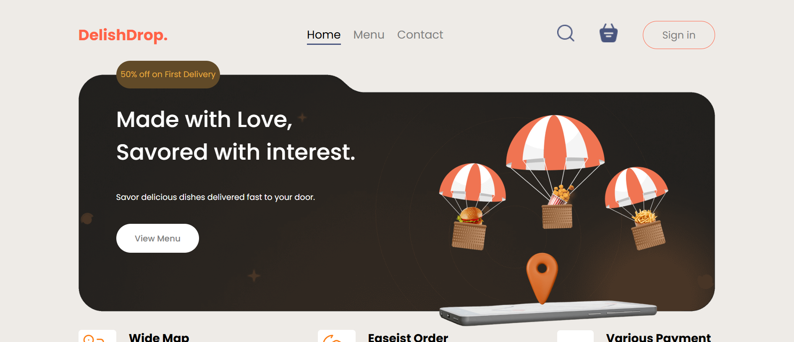
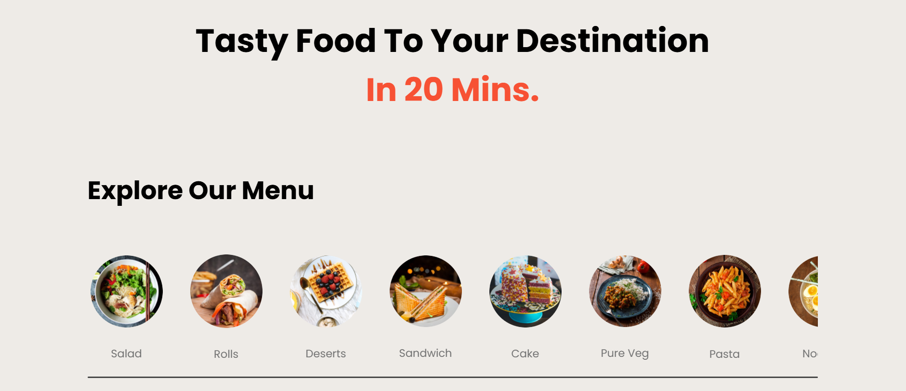
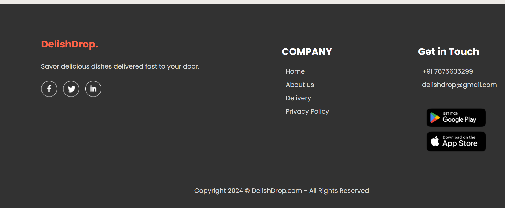
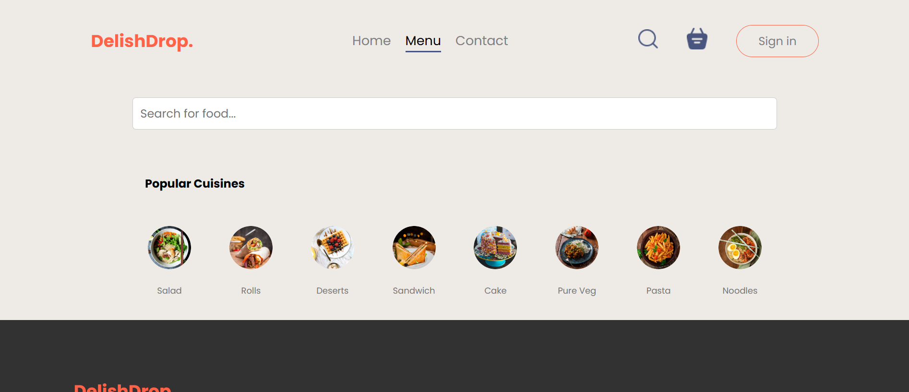
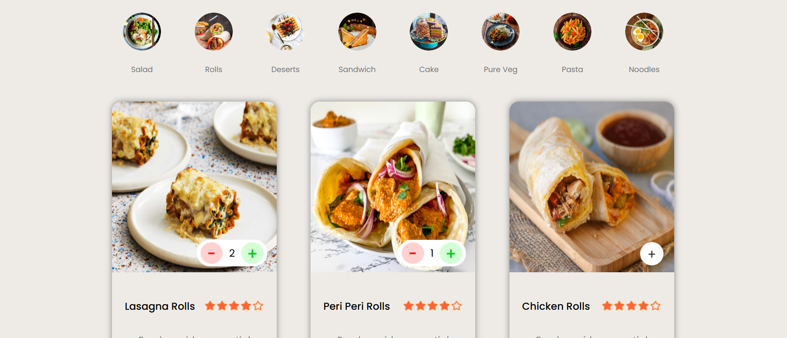
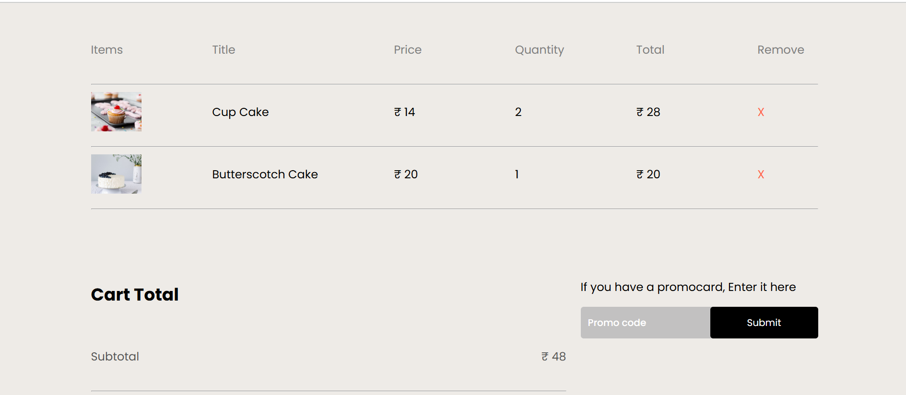
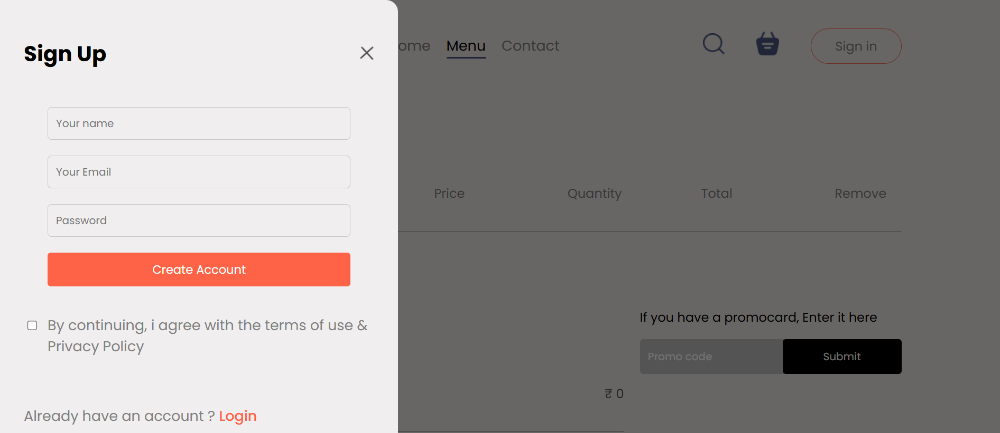
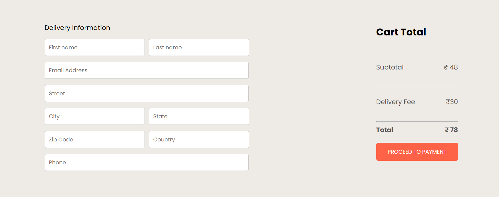

# Food Delivery App

A modern and responsive food delivery app built with React. This app allows users to search for food items, browse food categories, view cart, sign in, and manage their address. It provides a clean and user-friendly interface for a seamless food delivery experience.

## Features

- **Home Page**: Displays a header, food categories, and a search bar to browse food options.
- **Search Page**: Users can search for food items, with results displayed dynamically.
- **Cart**: Allows users to add items to their cart and view the total order.
- **Sign In**: Users can log into their accounts to access their personalized details.
- **Address Page**: Users can manage and update their delivery address.

## Pages

### Home Page
  

The Home Page consists of:

- **Header**: Contains the logo and navigation menu.
- **Menu**: Displays food categories like Pizza, Burgers, etc., allowing users to click on a category to view items.
- **Footer**: Shows contact information and social media links.

### Search Page
  

- **Search Bar**: A centered search bar where users can type food names. The search bar displays auto-suggestions as the user types.
- **Items Display**: Displays a grid or list of food items based on the search or category selected.
- **Add to Cart**: Each food item has an "Add to Cart" button to allow users to add it to their cart.

### Cart

- **Cart Overview**: Shows a list of items added to the cart with their quantity and price.
- **Total Amount**: Displays the total amount of the order.
- **Checkout Button**: A button that directs the user to the checkout page.

### Sign In

- **Login Form**: Users can enter their email and password to sign in to their account.
- **Sign Up Link**: A link to a sign-up page for new users.
- **Forgot Password**: A link to reset the password if the user forgets it.

### Address Page

- **Address Form**: Users can add, update, or delete their delivery address.
- **Save Button**: Saves the entered address.
- **Address Display**: Shows the current address saved for the user.

## Technologies Used

- **React**
- **React Router (for navigation)**
- **CSS (for styling)**

